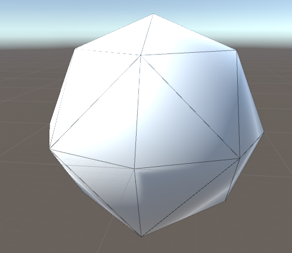

# Octahedron_Sphere

Octahedron sphere basically uses triangles to create the surface of the sphere.  Unlike a regular 3D sphere what is consider a UV sphere what is
reactangular grid wrapped around a sphere the lines to not compressed into a single point at the sphere.  This is important for textures and and if
and other transformations the sphere.  The squares have different levels of subdivisions ranging from 0 to 6 subdivisions.

Here is the shape with the following subdivision in the order 0, 1, 2, and 6

